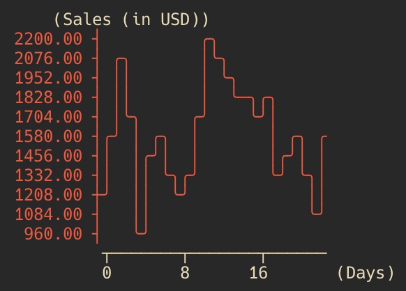

# ansi-chart

A lightweight and simple tool for rendering beautiful charts directly in your terminal using only ANSI-compatible ASCII characters. Create bar charts, line graphs, and more with customizable styles—no extra dependencies needed. Perfect for CLI applications, monitoring scripts, or just adding some visual punch to your console outputs!

## Installation
``` bash
npm install ansi-chart
```

## Usage

### 1. Create a Dataset

Use the Dataset class to pass in your data:

``` typescript
import { Dataset } from 'ansi-chart';

const dataset = new Dataset([
  [1, 2],
  [2, 3],
  [3, 4],
  [4, 5],
  [5, 6],
]);
```

Here, each sub-array ([x, y]) is a coordinate to plot. You can create as many datasets as you want and feed them to different chart types.

### 2. Plot a Scatter Chart

The ScatterPlot shows points for each data coordinate:

``` typescript
import { ScatterPlot, Dataset } from 'ansi-chart';

const scatterPlot = new ScatterPlot();
const dataset = new Dataset([
  [1, 2],
  [2, 3],
  [3, 4],
  [4, 5],
  [5, 6],
]);

scatterPlot.plot(dataset, [1, 1, 2, 1, 1, 2]);
```


### 3. Plot a Line Chart

Line charts connect the data points with ASCII lines:
``` typescript
import { LineChart } from 'ansi-chart';

const monthlySalesData = [
  1200, 1560, 2130, 1700, 960, 1450, 1600, 1350, 1200, 1400, 1700, 2200, 2100, 2000, 1800, 1850, 1730, 1800, 1360, 1450,
  1600, 1350, 1130, 1600,
];

const salesChart = new LineChart({
  xLabel: 'Days',
  yLabel: 'Sales (in USD)',
  height: 10,
});

salesChart.plot(monthlySalesData, '#ff4c33');
```



**LineChart Options**:

	•	xLabel and yLabel: Custom labels for the axes.
	•	height: Adjust how tall your chart should be in the terminal.
	•	plot(data, color): Data is an array of [x, y] pairs. The second argument can be a color or style code (or skip it for a default style).


Now you’re ready to add terminal charts to your projects with minimal fuss. Enjoy the nostalgia of ASCII while showcasing your data in style!